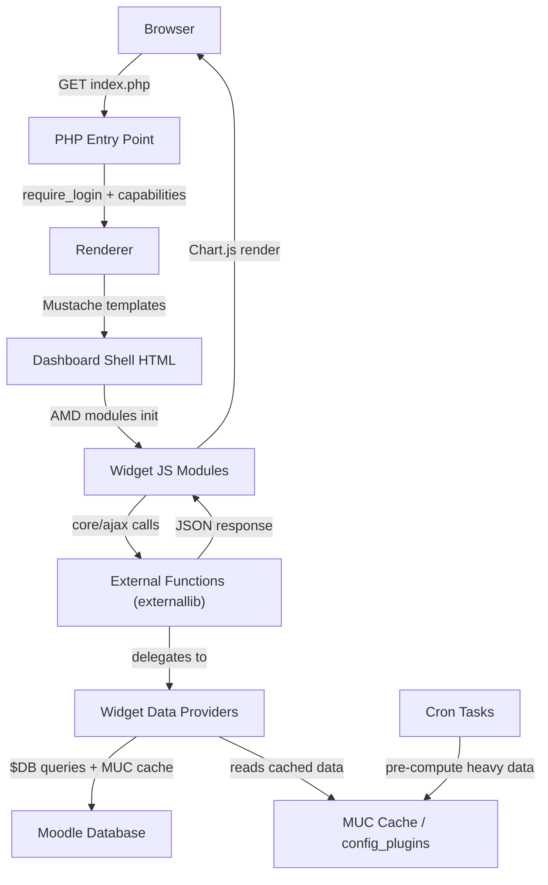

# Master Planning — Custom Analysis Dashboard Plugin

**Synthesis of 7 Reference Plugins — 2025-02-15**

> This document distills the architecture, features, patterns, concerns, and best practices from all 7 reference analysis-dashboard plugins to serve as the blueprint for building a custom master plugin (`local_analysis_dashboard`) for Moodle 4.5.

---

## Source Plugins Analyzed

| #   | Plugin                      | Type         | Moodle Compat | Key Focus                                                          |
| --- | --------------------------- | ------------ | ------------- | ------------------------------------------------------------------ |
| 1   | `block_analyticswidget`     | Block        | 3.8+          | Dashboard widgets, Chart.js, mobile app support                    |
| 2   | `gradereport_quizanalytics` | Grade Report | 4.4+          | Quiz-specific analytics, AJAX web services, DataTables             |
| 3   | `local_edudashboard`        | Local        | 4.0+          | Admin dashboard, scheduled tasks, multi-chart libs                 |
| 4   | `local_kopere_dashboard`    | Local        | 3.11+         | Full admin dashboard, server monitoring, visual editor, benchmarks |
| 5   | `local_learning_analytics`  | Local        | 3.4+          | Subplugin system, Plotly.js, router-based course analytics         |
| 6   | `logstore_lanalytics`       | Log Store    | 3.x+          | Event-driven log store, buffered writer, privacy-first design      |
| 7   | `report_lmsace_reports`     | Report       | 4.0–5.0       | Context-aware reporting, widget-based AJAX, Behat tests            |

---

## 1. Consolidated Feature Inventory

### 1.1 Dashboard & Visualization

| Feature                                                      | Source Plugins | Recommended Approach                   |
| ------------------------------------------------------------ | -------------- | -------------------------------------- |
| **Site-level stats** (total users, courses, enrolments)      | 3, 4, 7        | Widget cards with cached counters      |
| **Course-level stats** (completion, grades, activity)        | 1, 3, 5, 7     | Context-aware report page per course   |
| **Quiz analytics** (attempt trends, difficulty, improvement) | 2              | Dedicated quiz report submodule        |
| **User-level reports** (progress, grades, activity timeline) | 3, 7           | User profile report tab                |
| **Activity heatmaps** (weekday × hour usage)                 | 5              | Heatmap chart widget                   |
| **Learner engagement tracking**                              | 5, 6           | Time-on-page, clicks, device stats     |
| **Site visits over time**                                    | 7              | Line/bar chart widget from logstore    |
| **Server monitoring** (CPU, RAM, disk)                       | 4              | Background task + admin widget         |
| **Disk usage analysis**                                      | 3, 4, 7        | Scheduled task (never on page load)    |
| **Authentication/login reports**                             | 3              | Logstore query filtered by auth events |
| **Interactive data tables**                                  | 2, 4, 7        | DataTables with export (CSV/Excel)     |
| **Multiple chart types**                                     | ALL            | Chart.js (Moodle core) as sole library |

### 1.2 Architecture & Framework

| Feature                        | Source Plugins | Recommended Approach                     |
| ------------------------------ | -------------- | ---------------------------------------- |
| **Widget/component system**    | 1, 7           | Widget interface → Strategy Pattern      |
| **Subplugin extensibility**    | 5              | `lareport`-style subplugins for reports  |
| **AJAX data loading**          | 2, 4, 7        | Moodle External Functions + `core/ajax`  |
| **Scheduled background tasks** | 3, 4, 6        | Cron tasks for heavy calculations        |
| **MUC caching layer**          | 1, 3, 4, 7     | Cache definitions for all expensive data |
| **Router-based navigation**    | 4, 5           | Custom router or standard Moodle output  |
| **Mobile app support**         | 1              | `db/mobile.php` + mobile templates       |
| **Custom event logging**       | 5, 6           | Privacy-aware custom logstore            |
| **Privacy/GDPR compliance**    | 3, 5, 6, 7     | Privacy API provider + data thresholds   |
| **Behat E2E tests**            | 7              | Mandatory from day 1                     |
| **CI/CD pipeline**             | 1, 4, 7        | GitHub Actions with `moodle-plugin-ci`   |

### 1.3 Data Export

| Feature              | Source Plugins           | Recommended Approach      |
| -------------------- | ------------------------ | ------------------------- |
| **CSV/Excel export** | 4 (via jszip/DataTables) | DataTables export buttons |
| **PDF export**       | None (gap)               | Add via `mpdf` or similar |

---

## 2. Recommended Architecture

### 2.1 Plugin Type & Structure

```
local/analysis_dashboard/
├── amd/                     # AMD JavaScript modules
│   ├── build/               # Minified JS (Generated via Grunt)
│   └── src/                 # Source JS
│       ├── dashboard.js     # Main dashboard initializer
│       └── widgets/         # Per-widget chart renderers
├── classes/                 # PSR-4 autoloaded classes
│   ├── event/               # Custom Moodle events
│   ├── external/            # Web Service external functions
│   ├── local/
│   │   ├── widgets/         # Widget data providers (Strategy pattern)
│   │   ├── outputs/         # Output type abstractions (plot, table, card)
│   │   └── query/           # Query helpers per data domain
│   ├── output/              # Renderer + Renderables
│   ├── privacy/             # GDPR Privacy provider
│   └── task/                # Scheduled tasks
├── db/
│   ├── access.php           # Capabilities
│   ├── caches.php           # MUC cache definitions
│   ├── install.xml          # Custom DB tables (if needed)
│   ├── services.php         # External function registration
│   ├── tasks.php            # Scheduled task definitions
│   └── mobile.php           # Mobile app integration
├── lang/en/                 # English strings
├── pix/                     # Icons
├── templates/               # Mustache templates
│   └── widgets/             # Widget-specific templates
├── tests/
│   ├── behat/               # E2E scenarios
│   └── *.php                # PHPUnit tests
├── index.php                # Main entry point (site dashboard)
├── coursereport.php         # Course-level report entry
├── lib.php                  # Moodle hooks (navigation, etc.)
├── settings.php             # Admin settings
├── styles.css               # Custom CSS
└── version.php              # Plugin metadata
```

### 2.2 Architectural Pattern

**Widget-based Dashboard with AJAX Data Loading**



### 2.3 Data Flow

1. **Page Load**: `index.php` validates auth → Renderer outputs dashboard shell with widget placeholders
2. **Widget Init**: AMD `dashboard.js` discovers widgets, calls their `init()` methods
3. **Data Fetch**: Each widget JS calls `core/ajax` → `external/widgets.php` → widget PHP class
4. **Data Return**: Widget PHP class checks cache → queries DB if stale → returns JSON
5. **Render**: Widget JS receives JSON → renders Chart.js/DataTable
6. **Background**: Scheduled tasks pre-compute expensive metrics (disk usage, aggregations) into MUC

### 2.4 Key Design Decisions

| Decision                                     | Rationale                                                           | Reference                    |
| -------------------------------------------- | ------------------------------------------------------------------- | ---------------------------- |
| **`local` plugin type**                      | Most flexible; doesn't force a specific Moodle UI slot              | Plugins 3, 4, 5              |
| **Single charting library** (`core/chartjs`) | Avoid bloat from bundling ApexCharts+Highcharts+Plotly              | Lesson from Plugin 3         |
| **Widget Strategy Pattern**                  | Each metric is its own class; add new reports without touching core | Plugins 1, 7                 |
| **External Functions for data**              | Standard Moodle AJAX pattern; enables mobile support                | Plugins 2, 7                 |
| **Scheduled tasks for heavy ops**            | Never compute disk/aggregates on page load                          | Lessons from Plugins 3, 4, 7 |
| **Privacy thresholds**                       | Small datasets shouldn't reveal individual behavior                 | Plugin 5                     |
| **Tests from day 1**                         | Every reference plugin lacked tests — critical gap                  | All plugins                  |

---

## 3. Consolidated Concerns & Lessons Learned

### 3.1 Performance Anti-Patterns to Avoid

| Anti-Pattern                                              | Seen In | Mitigation                                                  |
| --------------------------------------------------------- | ------- | ----------------------------------------------------------- |
| Disk traversal on page load                               | 3, 4, 7 | Scheduled task + MUC cache only                             |
| Uncached logstore queries on millions of rows             | 2, 5, 7 | Aggregate tables or strict time-bounded queries + cache     |
| Loading 20+ charts simultaneously                         | 7       | Lazy-load charts on viewport entry                          |
| Synchronous heavy SQL in renderables                      | 3       | Move all heavy computation to tasks; renderables read cache |
| `glob()` / filesystem scanning at runtime                 | 1       | Static registry or class-map discovery                      |
| Tasks scheduled every minute for data that rarely changes | 3       | Hourly or daily schedules                                   |

### 3.2 Security Recommendations

| Risk                                           | Seen In | Recommendation                                                |
| ---------------------------------------------- | ------- | ------------------------------------------------------------- |
| Raw SQL concat                                 | 2, 7    | Always use `$DB` API with placeholders                        |
| Missing granular capability checks             | 1, 7    | Separate `view_site`, `view_course`, `view_user` capabilities |
| `shell_exec` for system stats                  | 4       | Avoid or isolate behind strong capability; provide fallback   |
| Editor saves bypassing Moodle File API         | 4       | Always use `file_storage` + `clean_text()`                    |
| Student data exposure via default capabilities | 5       | Restrict `view_statistics` to teacher/manager roles           |

### 3.3 Code Quality Standards

| Standard                                                    | Rationale                                        |
| ----------------------------------------------------------- | ------------------------------------------------ |
| PHPUnit tests for all widget data providers                 | Zero test coverage found across 6/7 plugins      |
| Behat E2E scenarios for dashboard load + navigation         | Only Plugin 7 has Behat tests                    |
| GitHub Actions CI with `moodle-plugin-ci`                   | Consistent quality gates                         |
| Single Responsibility — no "God Objects"                    | `report_helper` pattern (Plugin 7) is unscalable |
| PSR-4 namespacing throughout                                | Modern Moodle standard                           |
| No bundled third-party libraries where Moodle core provides | Avoid asset bloat (lesson from 3, 4)             |

---

## 4. Recommended Technology Stack

| Layer           | Technology                                | Notes                          |
| --------------- | ----------------------------------------- | ------------------------------ |
| **Backend**     | PHP 8.1+                                  | Moodle 4.5 requirement         |
| **Frontend**    | JavaScript ES6 (AMD)                      | Standard Moodle pattern        |
| **Charts**      | Chart.js via `core/chartjs`               | Moodle's built-in wrapper      |
| **Data Tables** | Moodle Table API + optional DataTables JS | For sortable/exportable tables |
| **Templates**   | Mustache                                  | Moodle standard                |
| **Caching**     | MUC (MODE_APPLICATION)                    | TTL-based invalidation         |
| **Testing**     | PHPUnit + Behat                           | Mandatory                      |
| **CI/CD**       | GitHub Actions + `moodle-plugin-ci`       | Lint + PHPCS + PHPUnit + Behat |
| **Target**      | Moodle 4.5                                | As per project roadmap         |

---

## 5. Widget Inventory for Custom Plugin

Based on the union of all features across the 7 reference plugins:

### Site-Level Widgets

- [ ] **Total Users** — count of active users
- [ ] **Total Courses** — count of visible courses
- [ ] **Total Enrolments** — aggregate enrolment count
- [ ] **Site Visits** — line chart from logstore (daily/weekly/monthly)
- [ ] **Active Users** — users logged in within last 7/30 days
- [ ] **Disk Usage** — moodledata + dirroot (via scheduled task)
- [ ] **Course Categories Overview** — tree with course counts

### Course-Level Widgets

- [ ] **Enrolment Stats** — enrolled count, active, inactive
- [ ] **Completion Progress** — bar/donut chart
- [ ] **Grade Distribution** — histogram of course grades
- [ ] **Activity Completion** — per-activity completion matrix
- [ ] **Quiz Analytics** — attempt stats, improvement curves, difficulty
- [ ] **Learner Activity Heatmap** — weekday × hour usage grid
- [ ] **Recent Activity** — timeline of latest actions

### User-Level Widgets

- [ ] **Course Progress** — all enrolled courses with completion %
- [ ] **Grade Overview** — grades across all courses
- [ ] **Login History** — chart of login frequency
- [ ] **Activity Timeline** — recent user actions

### Admin Widgets

- [ ] **Authentication Report** — login methods, failures
- [ ] **Server Performance** — CPU, RAM (optional; requires `shell_exec`)

---

## 6. Capability Design

```php
$capabilities = [
    // View the main dashboard
    'local/analysis_dashboard:viewsite' => [
        'captype' => 'read',
        'contextlevel' => CONTEXT_SYSTEM,
        'archetypes' => ['manager' => CAP_ALLOW, 'editingteacher' => CAP_ALLOW],
    ],
    // View course-level reports
    'local/analysis_dashboard:viewcourse' => [
        'captype' => 'read',
        'contextlevel' => CONTEXT_COURSE,
        'archetypes' => ['editingteacher' => CAP_ALLOW, 'teacher' => CAP_ALLOW],
    ],
    // View user-specific reports
    'local/analysis_dashboard:viewuser' => [
        'captype' => 'read',
        'contextlevel' => CONTEXT_USER,
        'archetypes' => ['editingteacher' => CAP_ALLOW],
    ],
    // View own analytics (for students)
    'local/analysis_dashboard:viewown' => [
        'captype' => 'read',
        'contextlevel' => CONTEXT_COURSE,
        'archetypes' => ['student' => CAP_ALLOW],
    ],
];
```

---

## 7. MUC Cache Definitions

```php
$definitions = [
    'sitestats' => [
        'mode' => cache_store::MODE_APPLICATION,
        'simplekeys' => true,
        'simpledata' => true,
        'ttl' => 3600, // 1 hour
    ],
    'coursestats' => [
        'mode' => cache_store::MODE_APPLICATION,
        'simplekeys' => true,
        'ttl' => 1800, // 30 minutes
    ],
    'diskusage' => [
        'mode' => cache_store::MODE_APPLICATION,
        'simplekeys' => true,
        'ttl' => 86400, // 24 hours (computed by task only)
    ],
];
```

---

## 8. Scheduled Tasks

| Task                     | Schedule      | Purpose                                  |
| ------------------------ | ------------- | ---------------------------------------- |
| `aggregate_site_stats`   | Hourly        | Pre-compute site-wide counters           |
| `aggregate_course_stats` | Every 6 hours | Pre-compute course completion/grade data |
| `calculate_disk_usage`   | Daily         | Filesystem traversal for disk stats      |
| `cleanup_stale_cache`    | Daily         | Purge orphaned cache entries             |

---

## 9. Implementation Phases

### Phase 1: Core & Data Layer (Current — per project roadmap)

- Plugin scaffold (`version.php`, `settings.php`, `lib.php`, `db/`)
- Widget base class + interface
- MUC cache setup
- External function scaffold
- 3 site-level stat widgets (users, courses, site visits)
- PHPUnit + Behat foundation

### Phase 2: Course Analytics

- Course report entry point
- Completion, grades, enrolment widgets
- Quiz analytics module
- DataTables integration

### Phase 3: User Analytics

- User report profile tab
- Progress, grades, login history widgets
- GDPR Privacy provider + data thresholds

### Phase 4: Admin Features

- Authentication reports
- Server monitoring (optional)
- Disk usage dashboard
- Export to CSV/Excel

### Phase 5: Polish & Mobile

- Mobile app templates (`db/mobile.php`)
- Lazy chart loading
- Accessibility audit
- Full CI pipeline

---

_Master planning synthesis: 2025-02-15_
_Source: 7 reference plugins × 7 planning documents each = 49 documents analyzed_
